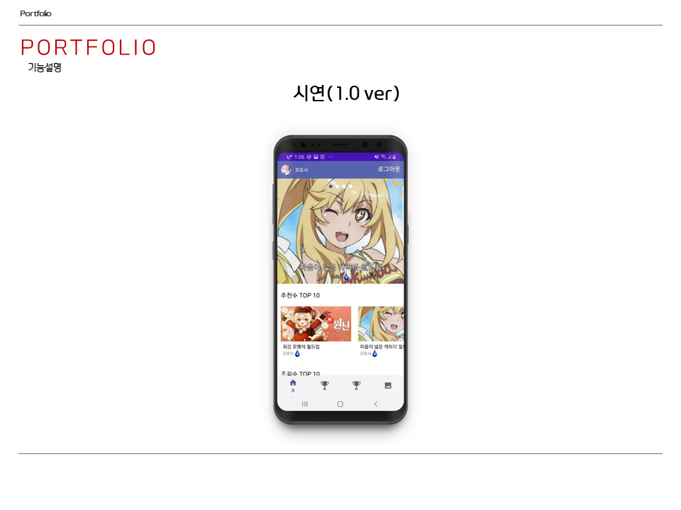
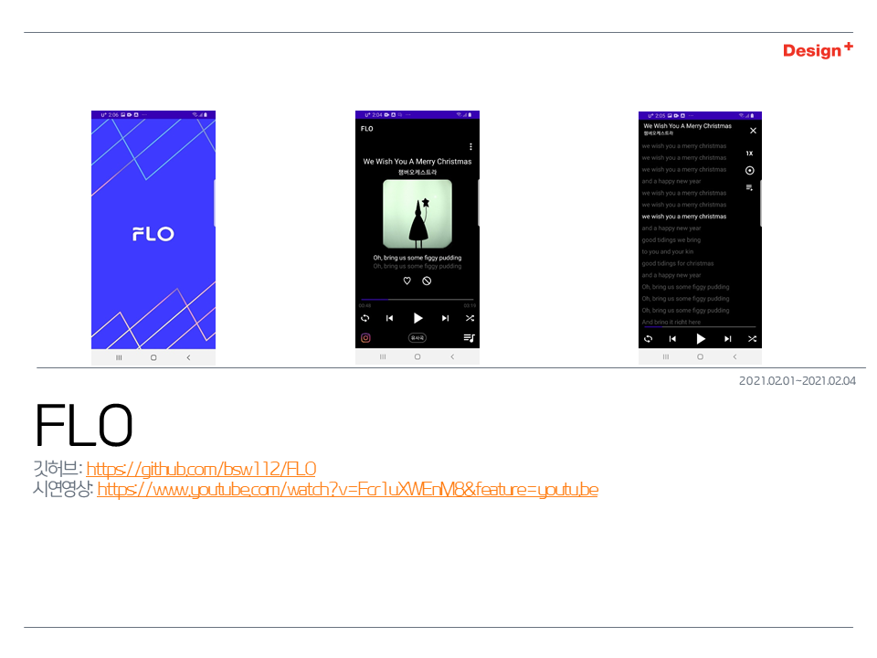
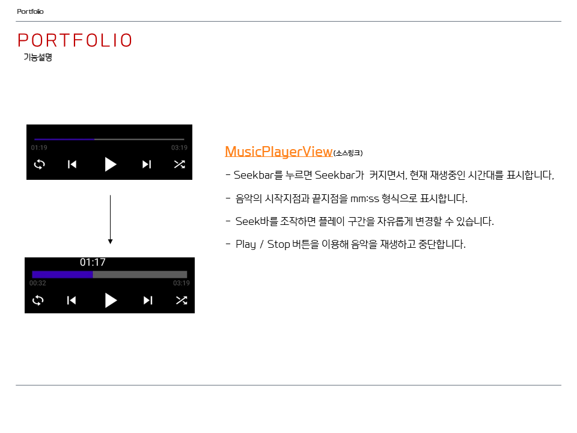

# 보트보트
다양한 주제의 일상속의 사진들을 업로드해 불특정 다수에게 투표를 받는 앱입니다. 
예를들어 쇼핑을 할때 A물건과 B물건이 고민된다면, 앱에 올려 투표를 받을 수 있습니다.

## 사용기술
Kotlin, Android Studio, MySQL, Node.js

## 주요기능
* 구글로그인
* 게시물 CRUD
* 갤러리에서 사진추가 혹은 즉석에서 카메라에서 사진촬영 후 추가가능
* 게시물을 스와이프로 탐색할 수 있습니다.
* 사진을 투표 후, 해당 게시물의 현재 투표현황을 확인할 수 있습니다.
* 게시물 사이에 애드몹 네이티브 광고도입

## 실제화면

## 시연

